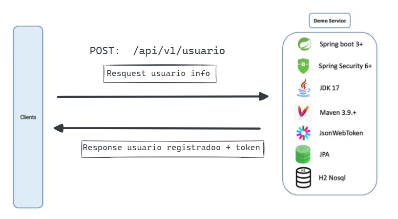
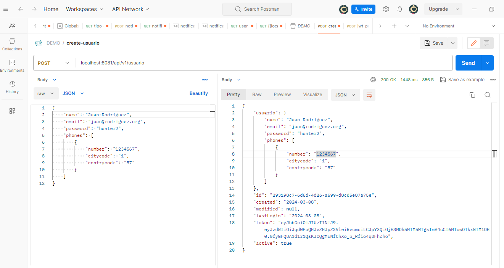
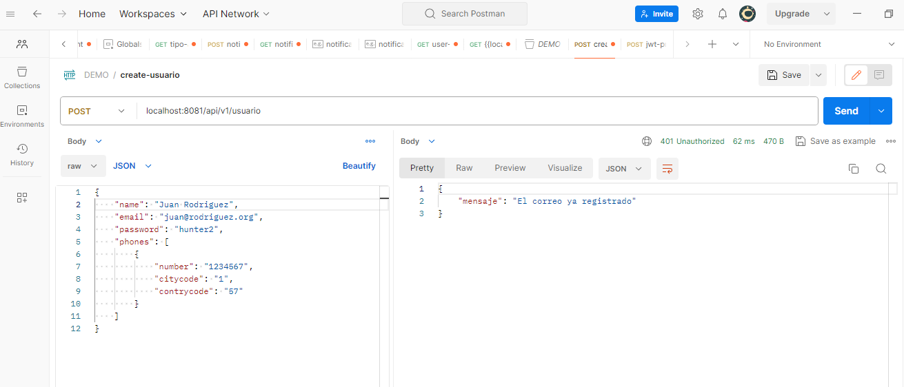
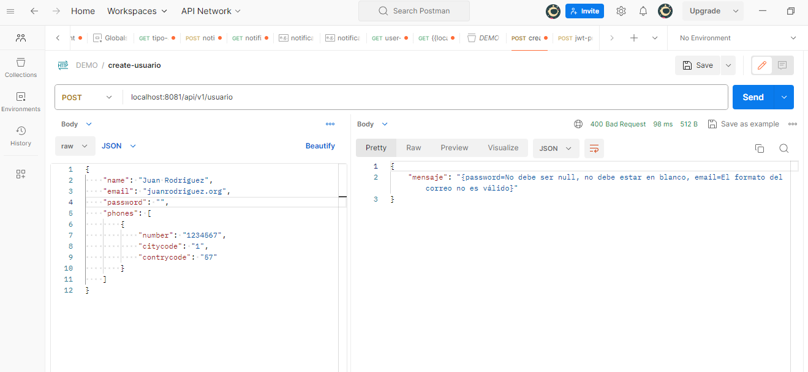
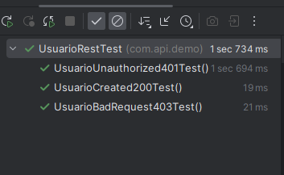

# Prueva Técnica JAVA


## Microservicio para registrar un usuario + token JWT

Este proyecto se desarrollo para ambiente local con el objetivo de demostrar  conocimiento técnico.

**Resquisitos**
- [x] Banco de datos en memoria. Ejemplo: HSQLDB o H2.9
- [x] Proceso de build vía Gradle o Maven.
- [x] Persistencia con JPA. Ejemplo: EclipseLink, Hibernate u OpenJPA.
- [x] Framework SpringBoot.
- [x] Java 8+
- [x] Entrega en un repositorio público (github o bitbucket) con el código fuente y script de
creación de BD.
- [x] Readme explicando cómo probarlo.
- [x] Diagrama de la solución.

**Requisitos opcionales**

- [x] JWT como token
- [x] Pruebas unitarias
- [x] Swagger

## Se usa JAVA 17, Spring Boot 3, Spring Security JWT , JPA + H2 bd en memoria 

Es una aplicación donde se expone una API RESTful de creación de usuarios.

## Arquitectura de la Aplicacion



**Diagrama de secuencia**


## Comando para clonar y ejecutar la aplicacion :
Antes de clonar el repositorio verifique que tenga instalado [JAVA 17](https://www.oracle.com/java/technologies/javase/jdk17-archive-downloads.html)

Link del repositorio github: https://github.com/rogerCL2020/smartJob-CreateUserJwt

Comando para clonar:
```
git clone https://github.com/rogerCL2020/smartJob-CreateUserJwt.git
```

Ubiquese en el directorio donde lo clono abra su shell o cmd y ejecute el jar:

```
java -jar demo\target\demo-0.0.1-SNAPSHOT.jar
```

## Demostracion y Pruebas con POSTMAN

Path:
```
localhost:8081/api/v1/usuario
```

Body JSON:
```
{
    "name": "Juan Rodriguez",
    "email": "juan@rodriguez.org",
    "password": "hunter2",
    "phones": [
        {
            "number": "1234567",
            "citycode": "1",
            "contrycode": "57"
        }
    ]
}
```
**Caso Prueba 1:**
```
Registro del usuario,
Response: status 200, se persiste el token JWT junto con el usuario
```


**Caso Prueba 2:**
```
Registrando un usuario con el mismo correo:
status 401
```


**Caso Prueba 3:**
```
Resgistrando con un email invalido(sin @) y un password en blanco: status 403
```



## Pruebas Unitarias
